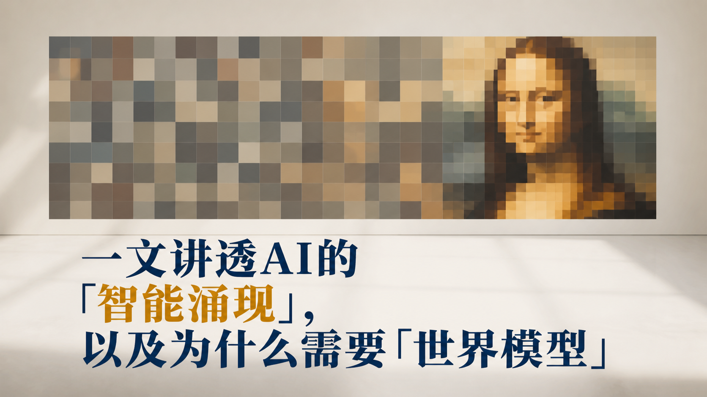
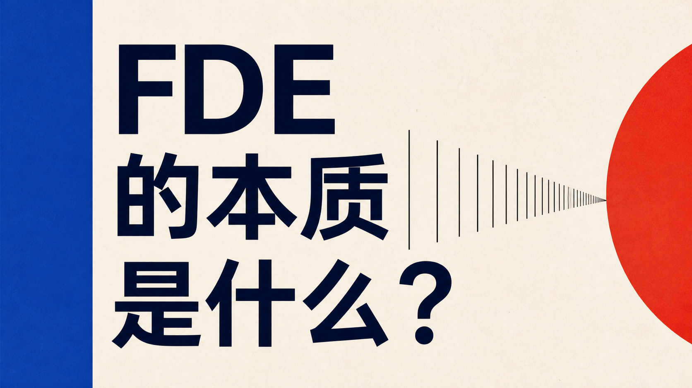

# 微信公众号封面艺术指导 Skill

一套面向中文微信公众号文章的封面策划与生成 Skill。

它不是简单地把文章标题塞进固定模板，而是持续积累用户真实采用与淘汰的封面，通过正向案例、负向案例、证据权重和模板路由，让后续生成越来越稳定地贴近个人审美。

> 核心目标：让新文章进来后，既能高效复用已经验证过的模板，也能在尚未探索的视觉空间中继续寻找更好的答案。

## 已验证封面案例

### 强正向：正文核心例子直接视觉化



这张封面把文章中的“马赛克像素跨过阈值后突然显出意义”直接做成主画面，是当前案例库中内容专属性较强的模板之一。

### 强正向：实体隐喻直接摄影化


当正文已经提供“一根杠铃”这种强实体隐喻时，优先把它做成单一高质感实物，并用配重尺度直接表达少数 Power User 与大量非用户，比扩写复杂组织场景更有效。

### 明亮科技编辑与真实材质

| 瑞士国际主义网格 | 矿物层理与单点结果 |
|---|---|
|  |  |

### 电影科技空间与高调光学摄影

| 电影空间与中央标题 | 高调光学摄影 |
|---|---|
|  |  |

更多正向案例见 [正向案例索引](references/approved-index.md)。

## 这个 Skill 解决什么问题

常见的 AI 封面生成容易出现几类问题：

- 所有技术文章都被做成黑底、蓝紫霓虹、发光方块和普通控制台。
- 画面看起来“像科技”，但主体与文章观点没有关系。
- 标题只是压在背景图上，没有真正设计字重、断行、位置和留白。
- 每次从零开始试错，已经成功和已经失败的方向没有沉淀。
- 用户说“勉强能用”和“实际采纳”，系统却把它们当成同等强度的正向反馈。

本 Skill 用四层机制解决这些问题：

1. **内容诊断**：先找到文章最值得视觉化的矛盾、因果、动作或例子。
2. **模板路由**：按标题容量、构图骨架、明暗、媒介和视觉张力匹配案例，而不是只按文章题材匹配。
3. **正负去重**：已经跑通的模板不重复浪费探索名额，已经淘汰的方向不换颜色重跑。
4. **反馈飞轮**：每轮筛选后同步更新图片、提示词、路由、偏好和避坑记录。

## 当前资产规模

- 32 个正向案例，包含强正向、正常通过、弱正向与视觉条件通过案例。
- 63 张有图反例。
- 90 个已淘汰提示词方向。
- 9 轮以上真实生成、筛选和反馈记录。

这些数字会随实际使用继续增长。仓库中的索引文件是当前状态的事实来源。

## 正向证据不是同权的

| 证据等级 | 用户反馈 | 后续使用方式 |
|---|---|---|
| 强正向 | 实际发布、实际采纳、同批最佳 | 可以作为直接适配模板和主要参考图 |
| 正常通过 | 达到标准、还可以、能够过关 | 可以复用结构，但优先级低于强正向 |
| 弱正向 | 勉强过关、不是很满意、勉强够用 | 只借用一个维度，不作为默认模板 |

路由时先比较证据权重，再比较构图或题材相似度。具体规则见 [模板路由](references/router.md)。

## 工作流程

```text
文章标题与正文
      ↓
提炼核心判断、矛盾、因果和视觉例子
      ↓
判断标题长度与排版容量
      ↓
路由到强正向 / 正常通过案例
      ↓
同时检查负向库，排除已知失败方向
      ↓
生成“模板复用组 + 发散探索组”
      ↓
检查标题、构图、配色、主体关系和缩略图效果
      ↓
用户打标：采纳 / 通过 / 勉强通过 / 淘汰
      ↓
更新案例、提示词、路由、偏好与负向索引
      ↓
Git commit + push + GitHub 远程读回验证
```

## 目录结构

```text
wechat-cover-art-director/
├── SKILL.md                         # Skill 入口、工作流与硬性约束
├── README.md                        # 项目说明
├── agents/
│   └── openai.yaml                  # Codex UI 元数据
├── assets/
│   ├── approved-covers/             # 用户明确通过的正向封面
│   └── rejected-covers/             # 按轮次保存的有图反例
└── references/
    ├── approved-index.md            # 正向案例总索引
    ├── cases/                       # 每个正向案例的完整提示词与复用说明
    ├── preferences.md               # 已确认的个人审美偏好
    ├── router.md                    # 标题容量与模板路由逻辑
    ├── template-space.md            # 已通过、已淘汰与待探索空间
    ├── creative-system.md           # 发散设计方法
    ├── quality-gate.md              # 生成后的质量检查
    ├── rejections.md                # 跨批次失败模式与经验
    ├── rejected-index.md            # 负向资产索引
    └── rejected-prompts/            # 被淘汰的提示词方向
```

## 安装

### 克隆到 Codex Skills 目录

```bash
git clone https://github.com/Stephen-creater/wechat-cover-art-director.git \
  "${CODEX_HOME:-$HOME/.codex}/skills/wechat-cover-art-director"
```

如果本地已经安装：

```bash
cd "${CODEX_HOME:-$HOME/.codex}/skills/wechat-cover-art-director"
git pull --ff-only origin main
```

安装完成后重新开始一个 Codex 任务，让 Skill 目录重新被发现。

## 使用方法

直接把标题和正文交给 Codex：

```text
使用 $wechat-cover-art-director。

标题：一文讲透AI的「智能涌现」，以及为什么需要「世界模型」

正文：……

生成 10 张微信公众号封面：
- 5 张复用已经通过的模板
- 5 张进行发散探索
```

也可以自然语言调用：

```text
这是我的新文章，请按照我过去采用过的公众号封面审美，
生成 5 个差异明显的方向，不要黑底扎堆。
```

## 默认审美原则

- 默认不使用纯黑或大面积近黑背景。
- 科技感不等于蓝紫霓虹、玻璃面板、机器人和发光大脑。
- 吸引力来自一个强主体、清楚的尺度关系、克制配色和成熟排版。
- 标题是第一视觉层级，通常控制在 1–3 行。
- 标题居中时，标题块的几何中心必须同时落在画布水平与垂直中心。
- 主体、高光、纹理和轨道不能直接穿过标题。
- 文章中的核心例子优先于抽象科技隐喻。
- 用户没有明确通过的候选不得进入正向资产库。

完整偏好见 [个人偏好记录](references/preferences.md)，详细检查项见 [质量门](references/quality-gate.md)。

## 如何更新案例库

### 新增正向案例

1. 图片复制到 `assets/approved-covers/`。
2. 最终提示词与证据强度写入 `references/cases/`。
3. 更新 `references/approved-index.md`。
4. 更新 `references/router.md` 与 `references/preferences.md`。
5. 根据模板语法更新 `references/template-space.md`。

### 新增负向案例

1. 有图反例复制到 `assets/rejected-covers/<round>/`。
2. 提示词保存到 `references/rejected-prompts/<round>/`。
3. 更新 `references/rejections.md` 与 `references/rejected-index.md`。
4. 用户没有说明逐张原因时，只标记“批次淘汰”，不擅自编造审美结论。

## GitHub 同步纪律

这个 Skill 不允许只更新本地。

任何图片、案例、提示词、偏好、路由或规则变更，都必须完成：

```text
本地验证
→ git status / diff 检查
→ commit
→ push origin main
→ 从 GitHub 读回远程提交与关键文件
```

存在未提交或未推送的变更时，不得宣称 Skill 更新完成。

## 重要边界

- 本仓库保存的是个人审美经验与提示词路由，不承诺所有模型每次都能准确生成中文文字。
- 正向案例用于控制结构、材质、配色和版式，不应该机械复制原图。
- 负向案例用于避坑，不应作为参考图输入生成模型。
- 本 Skill 默认依赖 Codex 环境中的图片生成能力；仓库本身不包含图片模型或 API 密钥。
- 当前仓库没有声明开源许可证。未经许可，不应默认拥有复制、修改或再分发授权。

## 相关入口

- [Skill 主入口](SKILL.md)
- [正向案例索引](references/approved-index.md)
- [模板路由](references/router.md)
- [模板空间台账](references/template-space.md)
- [个人偏好记录](references/preferences.md)
- [失败模式](references/rejections.md)

---

公开仓库：<https://github.com/Stephen-creater/wechat-cover-art-director>
